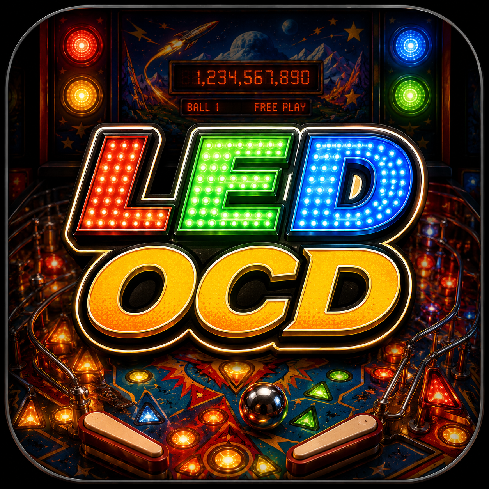

# LED OCD for Mac    


A native macOS app for configuring **LED OCD** and **GI OCD** boards — the
pinball lamp controllers created by **Harold Toler** ([ledocd.com](https://ledocd.com))
that make LEDs in classic pinball machines fade smoothly like incandescent
bulbs instead of snapping on and off.

**⬇️ [Download the latest release](https://github.com/rodclemen/ledocd-mac/releases/latest)** —
grab `LED-OCD.dmg`, open it, and drag the app to Applications. Signed and
notarized; macOS 12 or newer, Apple Silicon and Intel.

## Credit where it's due

This app is entirely built on the foundation of **Harold Toler's LED & GI OCD**.
Harold designed the boards, wrote the firmware, defined the serial protocol, and
built the original configuration software (the C command-line tools and the web
GUI) that this app is a faithful native-Mac rewrite of. The machine lamp maps
are his, served from ledocd.com. None of this would exist without that work —
this project only re-wraps it in a modern Mac interface.

## What it does

The board sits between the game and the playfield LEDs. This app talks to it
over its FTDI USB-serial cable and lets you:

- Assign one of 8 **brightness profiles** to every lamp (how dim, how bright,
  how smooth the fade).
- Tune those profiles in **Live Mode** while watching the real lamps update in
  real time — no guessing at numbers.
- Load the **lamp names for your machine** (100+ machines: WPC / Williams /
  Bally / Data East, Stern, Capcom) so you edit "Left Ramp", not "lamp 36".
  Names only — picking a game never changes your settings: those live on the
  board itself (Save makes them permanent), with Export files as your
  per-machine backups.
- Add, clone, rename, and delete **custom games** for machines not in the list.
- Configure **GI OCD** general-illumination strings (normal/active brightness,
  activity response, fade speed, 50 Hz, output frequency).
- **Send** settings to the board, **Save** them permanently, **Read** back
  what's stored, and **Import/Export** configs as files (compatible with the
  original Windows app's XML format). The buttons guide the workflow: Send
  turns green when you have unsent edits, Save turns red until they're stored.
- Test hardware with **Manual Test** (light any lamp by hand, checkerboard
  pattern), or explore the whole app with **Simulate Board** — no hardware
  needed.

## Using it

1. Plug the board into your Mac with its USB cable (macOS includes the FTDI
   driver; the port appears as `/dev/cu.usbserial-…`).
2. Launch the app, click **Scan**, pick the port under **COM Select**, click
   **Connect** — the app detects LED vs GI OCD and the lamp matrix, and loads
   the settings currently on the board.
3. Pick your machine under **Game Select** (the manufacturer tags filter the
   list; the detected one lights green).
4. Set each lamp's profile in the **Profile** column; shape each profile's
   B1–B8 brightness curve and Delay.
5. **Send** (green when you have unsent edits) tries your settings on the
   board; **Save** (red until pressed) stores them permanently. Or turn on
   **Live Mode**, tune while watching the real playfield, and press
   **Commit Changes** — send + save in one press.

A full manual covering every feature is built in: press **i**, click the **?**
at the top right, or use **Help → LEDOCD Manual**.

## Requirements

- macOS 12 or newer, Apple Silicon or Intel (universal binary).
- An LED OCD or GI OCD board with its FTDI USB-serial cable (or use
  Advanced → Simulate Board to run without hardware).

---

# Technical

## Build

```sh
./build.sh        # universal release build -> signed dist/LED OCD.app
./makedmg.sh      # package -> dist/LED-OCD.dmg
```

`build.sh` builds a universal SwiftPM binary, compiles the icon asset catalog
from `app_icon.png`, bundles the machine presets from `data/*.csv` into
`Contents/Resources/data/` and the manual (`docs/manual.html`) as
`Contents/Resources/manual.html`, and signs with a hardened runtime. No Xcode
project — plain SwiftPM.

**Signing is automatic and needs no configuration:** if your keychain holds a
"Developer ID Application" certificate it is used; otherwise the app is ad-hoc
signed, which runs fine on your own Mac (no Apple Developer account needed to
build). Override with `LEDOCD_SIGN_ID="Developer ID Application: …" ./build.sh`.

## Notarize (to share without Gatekeeper warnings)

Distributing to other Macs without warnings requires an Apple Developer
account. One-time setup — store your credentials in the macOS keychain (an
app-specific password from <https://account.apple.com> → Sign-In and Security
→ App-Specific Passwords; nothing is ever written to this repo):

```sh
xcrun notarytool store-credentials LEDOCD --apple-id "you@example.com" --team-id "YOURTEAMID"
```

After that, notarizing is just:

```sh
./notarize.sh
```

This submits the DMG to Apple's automated malware scan, staples the approval
ticket, and re-packages a ready-to-share DMG.

## Release

```sh
./release.sh
```

One command: builds, packages, notarizes, and publishes a GitHub release named
after the `VERSION` in `build.sh`, using that version's CHANGELOG section as
the release notes. Refuses to run with uncommitted changes or an existing tag.

## Source layout (`Sources/LEDOCD/`)

| File | Role |
|------|------|
| `SerialPort.swift` | POSIX `termios` serial layer (9600 8N1 raw) + simulator mode |
| `OCDDevice.swift` | Wire protocol: every LED/GI command, version & read-settings frame parsing, lamp-number → matrix col/row mapping |
| `Models.swift` | `LEDConfig` / `GIConfig` with factory defaults and `<Q>` frame parsers |
| `Presets.swift` | Machine CSV loader — bundled + refreshed + custom games, WPC/Stern/Capcom detection |
| `DataSync.swift` | In-app "Refresh Machine Data" — pulls current CSVs from ledocd.com |
| `ConfigIO.swift` | Import/Export in the original Windows app's XML format (byte-identical export) |
| `Preview.swift` | Live Mode engine — persistent manual-mode serial session, fade math |
| `ManualTest.swift` | Manual Test window — per-lamp/string levels, checkerboard, all-off |
| `Help.swift` | The in-app manual window (renders the bundled `docs/manual.html`) |
| `Components.swift`, `LEDView.swift`, `GIView.swift`, `App.swift` | SwiftUI UI |

`makeicon.swift` (repo root) reshapes `app_icon.png` into the macOS icon
squircle template at build time.

## Data locations

| What | Where |
|------|-------|
| Bundled machine CSVs | `data/` (repo) → `Contents/Resources/data/` (app) |
| Refreshed machine data | `~/Library/Application Support/LED OCD/data/` |
| Custom (user-created) games | `~/Library/Application Support/LED OCD/custom/` |

Custom games live in their own folder so a machine-data refresh can never
overwrite them; a custom game may even share a name with a default one.

## Wire protocol notes

- 9600 baud 8N1 over the FTDI cable; every command is a `<…>` frame, with a
  40 ms pause between messages (the firmware needs it).
- `<V>` reads the firmware version — board type + version number; the version
  implies the lamp matrix (but Capcom A vs B can't be told apart by firmware).
  `<Q>` makes the board stream its whole configuration back as `{…}` frames.
  `<S>` persists the board's current settings to nonvolatile memory.
- Lamp number ↔ matrix position: WPC/Capcom `lamp = (col+1)·10 + (row+1)`
  (lamps 11–88); Stern `lamp = row·8 + col + 1` (lamps 1–80). Reads are
  decoded with the selected game's matrix when one is chosen (more specific
  than firmware — that's how Capcom A/B is resolved).
- Capcom B boards need a relay prefix on every message; the app adds it
  automatically when the matrix is Capcom B.

## Provenance

The serial protocol was transcribed message-for-message from Harold Toler's
`ledocd_cli/cli.c` and `giocd_cli/cli.c`; the CSV parsing rules from his
`ledocd.awk`; behavior verified against the official usage docs on ledocd.com.
CSV format: one `lampNumber,insertName` line per lamp; a lamp number below 11
means a Stern matrix; `CAPCOM_A` / `CAPCOM_B` marker lines select the Capcom
matrix (B uses a relay prefix on every serial message).
